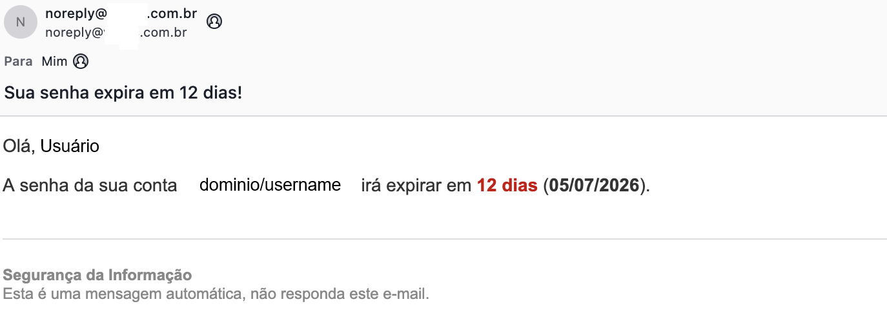

# ADPassExpiryNotifier

Esse script surgiu de uma situação em que o time de HelpDesk recebia muitos chamados de usuários, principalmente os que não utilizam Windows, de senha expirada, pois não eram avisados ao logar, como acontece no Windows. Ele faz uma query no AD buscando usuários em que as senhas vão expirar em 21 dias e manda um e-mail notificando.

Agende via "Task Scheduler" para rodar uma vez por dia, o número de chamados vai cair consideravelmente.

## Como usar

```bash
git clone https://github.com/your-username/toolbox.git
cd toolbox
powershell.exe ADPassExpiryNotifier\ad_pass_notification.ps1
```



---